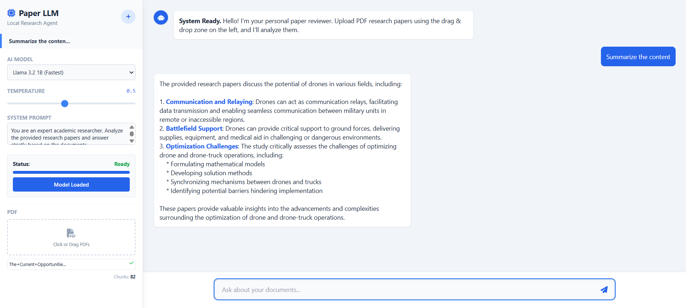

# Paper_Analysis_LLM



## Project Overview
This project is a client-side web application designed to assist researchers in analyzing PDF documents using Large Language Models (LLMs). Unlike traditional cloud-based solutions, this application runs entirely in the user's browser using WebGPU technology. It ensures complete data privacy as no document is uploaded to an external server.

The system implements a Retrieval-Augmented Generation (RAG) pipeline using Vanilla JavaScript, allowing users to chat with their documents, generate summaries, and extract specific information with source citations.

## Key Features
* **Privacy-First Architecture:** All inference and embedding calculations are performed locally using WebLLM and Transformers.js.
* **RAG Pipeline:** Ingests PDF documents, chunks text, generates vector embeddings, and performs cosine similarity search to retrieve relevant context.
* **Multi-Model Support:** Users can switch between `Llama-3.2-1B` (optimized for speed) and `Llama-3.2-3B` (optimized for reasoning capabilities).
* **Advanced Agent Configuration:** Real-time adjustment of model temperature and system prompts.
* **Multi-Chat Management:** Support for multiple concurrent conversation threads with persistent history during the session.

## Technical Stack
* **Core Logic:** Vanilla JavaScript (ES Modules)
* **UI/UX:** HTML5 & Tailwind CSS
* **LLM Inference:** WebLLM (MLC AI)
* **Embeddings:** Transformers.js (Xenova/all-MiniLM-L6-v2)
* **PDF Processing:** PDF.js

## Installation and Local Setup

Due to browser security restrictions regarding `SharedArrayBuffer` (required for WebGPU), this application must be served with specific HTTP headers (`Cross-Origin-Opener-Policy` and `Cross-Origin-Embedder-Policy`).

### Prerequisites
* A modern browser with WebGPU support (Chrome 113+, Edge, or equivalent).
* Python 3.x (for the local server).

### Steps
1.  **Clone the repository:**
    ```bash
    git clone [https://github.com/suva14/Paper_Analysis_LLM.git](https://github.com/suva14/Paper_Analysis_LLM.git)
    cd Paper_Analysis_LLM
    ```

2.  **Start the local server:**
    Run the following command in the project root directory:
    ```bash
    python -m http.server
    ```

3.  **Access the application:**
    Open your browser and navigate to `http://localhost:8000`.

## Usage Guide
1.  **Configuration:** Select the desired AI model from the sidebar. The "1B" model is recommended for faster initial loading.
2.  **Initialization:** Click "Load Model" to download and compile the model weights (cached for subsequent uses).
3.  **Ingestion:** Drag and drop PDF research papers into the PDF area.
4.  **Interaction:** Use the chat interface to ask questions. The agent will analyze the vector store and provide answers based on the uploaded content.

## Deployment Notes
This project is configured for deployment on static hosting services like GitHub Pages. A `coi-serviceworker.js` script is included to automatically handle the required cross-origin isolation headers in environments where server configuration is not possible.